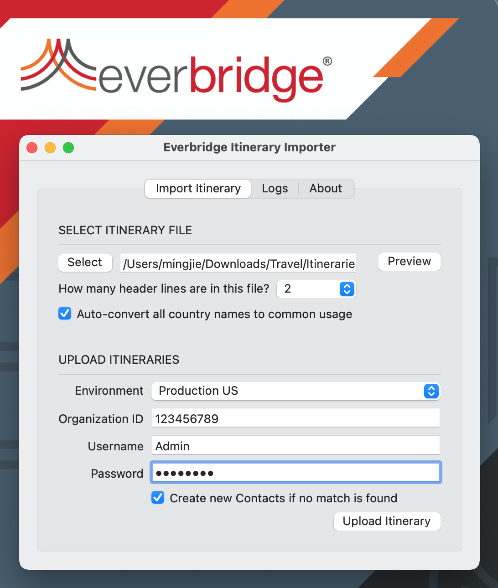

## Download the Tool

- Microsoft Windows: [ItineraryImporter-Windows-v20220907.zip](https://github.com/Everbridge/Travel-Itinerary-Importer/releases/download/rel-20221025/ItineraryImporter-Windows-v20221025.zip)
- Apple macOS (ARM64): [ItineraryImporter-macOS-arm64-v20220907.zip](https://github.com/Everbridge/Travel-Itinerary-Importer/releases/download/rel-20221025/ItineraryImporter-macOS-arm64-v20221025.zip)
- Apple macOS (x86_64): [ItineraryImporter-macOS-x86_64-v20220907.zip](https://github.com/Everbridge/Travel-Itinerary-Importer/releases/download/rel-20221025/ItineraryImporter-macOS-x86_64-v20221025.zip)

## Itinerary Template

[Itinerary.xlsx](https://github.com/Everbridge/Travel-Itinerary-Importer/releases/download/rel-20221025/Itinerary.xlsx)

## User Guide

1. Open the itinerary template file and prepare the itineraries.

   - Ensure the XLSX spreadsheet is saved and closed before uploading the itinerary.

2. Launch the Travel Itinerary Importer. Click the `Select` button to open the itinerary template file.

   - Check the `Auto-convert all country names to common usage` option to convert the country to the code required by the Everbridge service.

3. Click the `Preview` button and go to `Logs` tab to preview the data.

4. To upload the itineraries, select the Everbridge environment, enter Organization ID and user credentials, then click `Upload Itineraries` button. Wait for a few moments and check the result in the `Logs` tab.

   - The Organization ID can be located in the Manager Portal under `Settings` &rarr; `Organization` &rarr; `Base Information`.
   - The user must have API access, please contact support or your account administrator for more information.
   - Check the `Create new Contacts if no match is found` option to enable contact creation.

